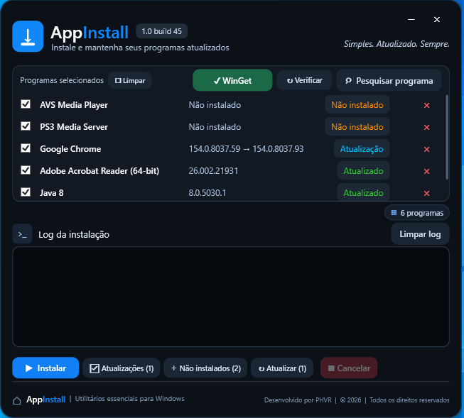

---

<p align="center">
  
</p>

---
# AppInstall

**AppInstall** é um gerenciador gráfico de instalação e atualização de programas para Windows, desenvolvido em **C# / WPF / .NET 8** e baseado no **Windows Package Manager (WinGet)**.

A proposta é oferecer uma interface simples para pesquisar, instalar e atualizar vários programas sem precisar executar manualmente comandos do WinGet.

> O AppInstall não hospeda instaladores dos programas. A pesquisa, detecção de versões e instalação dos pacotes são feitas através do WinGet e das fontes definidas nos manifests do repositório oficial do Windows Package Manager.

## Recursos

- Interface gráfica WPF com tema escuro.
- Pesquisa de programas diretamente no catálogo do WinGet.
- Instalação silenciosa de programas selecionados.
- Detecção da versão atualmente instalada.
- Detecção de atualizações disponíveis.
- Atualização somente dos programas selecionados.
- Identificação de programas ainda não instalados.
- Verificação manual de versões pelo botão **Verificar**.
- Ordenação automática da lista por status:
  1. Não instalado
  2. Atualização disponível
  3. Atualizado
- Repetição de instalações que falharam.
- Cancelamento da operação em andamento.
- Log em tempo real dentro da própria interface.
- Progresso de download exibido no log quando o WinGet fornece os dados.
- Fallback com tempo decorrido quando o instalador não informa porcentagem.
- Persistência opcional de programas através do arquivo `programas.json`.
- Instalação/reparo automático do WinGet quando ele não estiver disponível.
- Publicação como **um único executável self-contained**.

## Como funciona por trás da interface

O AppInstall funciona principalmente como uma camada gráfica sobre o WinGet.

### 1. Verificação do WinGet

Ao iniciar, o programa procura o `winget.exe` primeiro em:

```text
%LOCALAPPDATA%\Microsoft\WindowsApps\winget.exe
```

Depois também procura através do `PATH` do Windows.

A disponibilidade é validada executando:

```powershell
winget --version
```

A checagem possui timeout para evitar que uma instalação quebrada do App Installer congele a interface.

### 2. Pesquisa de programas

A janela de pesquisa consulta a fonte `winget` usando combinações de:

```powershell
winget search --query "TERMO" --source winget
winget search --name "TERMO" --source winget
winget search --id "TERMO" --source winget
```

Os resultados são unidos pelo **Package ID**, classificados por relevância e priorizam variantes compatíveis com o idioma atual do Windows quando disponíveis.

### 3. Verificação de instalação e atualização

Para identificar se um programa está instalado e se existe uma versão mais recente, o AppInstall executa consultas equivalentes a:

```powershell
winget list --id "PACKAGE.ID" -e --source winget --accept-source-agreements --disable-interactivity
```

A partir do retorno, o programa classifica cada item como:

```text
Não instalado
Atualização
Atualizado
```

### 4. Instalação

A instalação padrão é executada aproximadamente desta forma:

```powershell
winget install --id "PACKAGE.ID" -e --source winget --silent --accept-package-agreements --accept-source-agreements --disable-interactivity
```

O AppInstall captura `stdout` e `stderr` do processo para exibir as informações no log da interface.

### 5. Downloads

Os instaladores dos aplicativos não são baixados pelo AppInstall diretamente.

O **WinGet** resolve o manifest do pacote e baixa o instalador a partir da URL definida naquele pacote, que normalmente pertence ao próprio fabricante do software.

O AppInstall apenas interpreta o output do WinGet para mostrar:

- URL de download quando fornecida;
- quantidade baixada;
- tamanho total;
- porcentagem;
- tempo de download;
- início e fim da instalação.

## Instalação automática do WinGet

Se o WinGet não estiver disponível, o AppInstall primeiro tenta registrar novamente uma instalação existente do **Microsoft Desktop App Installer** através do PowerShell / `Add-AppxPackage`.

Se isso não for suficiente, baixa o App Installer oficial da Microsoft a partir de:

```text
https://github.com/microsoft/winget-cli/releases/latest/download/Microsoft.DesktopAppInstaller_8wekyb3d8bbwe.msixbundle
```

Com fallback para:

```text
https://aka.ms/getwinget
```

Quando necessário, também baixa as dependências oficiais:

```text
https://github.com/microsoft/winget-cli/releases/latest/download/DesktopAppInstaller_Dependencies.zip
```

Os arquivos temporários são armazenados em uma pasta exclusiva dentro de `%TEMP%` e removidos ao final da operação.

## Casos tratados especificamente

### Google Chrome

O WinGet pode identificar instalações do Chrome através de mais de um Package ID.

O AppInstall verifica:

```text
Google.Chrome
Google.Chrome.EXE
```

Para uma nova instalação, o projeto atualmente utiliza preferencialmente:

```text
Google.Chrome.EXE
```

Isso evita que uma instalação já existente seja incorretamente exibida como `Não instalado` apenas por ter sido instalada através de outra variante do pacote.

### Java 8

O pacote:

```text
Oracle.JavaRuntimeEnvironment
```

é executado com parâmetros específicos para uma instalação silenciosa compatível:

```text
/s REBOOT=0 SPONSORS=0 AUTO_UPDATE=0
```

## `programas.json`

O arquivo `programas.json` é **opcional**.

Se ele não existir, o AppInstall inicia normalmente com a lista vazia. O arquivo só é criado quando o usuário escolhe **Adicionar ao programas.json** na janela de pesquisa.

Exemplo:

```json
{
  "programas": [
    {
      "nome": "Google Chrome",
      "id": "Google.Chrome"
    },
    {
      "nome": "7-Zip",
      "id": "7zip.7zip"
    },
    {
      "nome": "Mozilla Firefox",
      "id": "Mozilla.Firefox"
    }
  ]
}
```

O arquivo fica no mesmo diretório do `AppInstall.exe`.

Se o último item persistente for removido, o arquivo é excluído automaticamente.

## Requisitos para executar

### Sistema

- Windows 10 ou Windows 11 x64.
- Acesso à Internet para pesquisa/download dos pacotes.
- Permissão de administrador.

O manifesto do aplicativo utiliza:

```xml
<requestedExecutionLevel level="requireAdministrator" uiAccess="false" />
```

Por isso o Windows solicita elevação pelo UAC ao iniciar o AppInstall.

### .NET no computador do usuário

A publicação oficial do projeto utiliza:

```text
--self-contained true
```

Portanto, **não é necessário instalar separadamente o .NET Runtime** no computador que irá executar a versão publicada do AppInstall.

## Requisitos para compilar

Para compilar o projeto são necessários:

- Windows 10/11 x64;
- **.NET 8 SDK**;
- PowerShell disponível no Windows;
- opcionalmente Visual Studio 2022 com suporte a desenvolvimento desktop .NET.

Visual Studio não é obrigatório. O projeto pode ser compilado diretamente pelo terminal usando o SDK do .NET.

Verifique o SDK instalado com:

```powershell
dotnet --info
```

ou:

```powershell
dotnet --list-sdks
```

É necessário ter uma versão `8.x` do SDK.

## Compilando o projeto

Clone ou baixe o repositório e abra um terminal na pasta do projeto.

### Método recomendado

Execute:

```text
PUBLICAR.cmd
```

Esse script primeiro limpa builds anteriores e depois executa a publicação para Windows x64.

### Comando usado pelo projeto

```powershell
dotnet publish -c Release -r win-x64 --self-contained true -p:PublishSingleFile=true -p:IncludeNativeLibrariesForSelfExtract=true -p:EnableCompressionInSingleFile=true
```

A configuração também está registrada no `Instalador.csproj`:

```xml
<TargetFramework>net8.0-windows</TargetFramework>
<UseWPF>true</UseWPF>
<PublishSingleFile>true</PublishSingleFile>
<SelfContained>true</SelfContained>
<IncludeNativeLibrariesForSelfExtract>true</IncludeNativeLibrariesForSelfExtract>
<EnableCompressionInSingleFile>true</EnableCompressionInSingleFile>
<DebugType>none</DebugType>
<DebugSymbols>false</DebugSymbols>
```

## Arquivo gerado

Após a publicação, o executável fica normalmente em:

```text
bin\Release\net8.0-windows\win-x64\publish\AppInstall.exe
```

A intenção do projeto é que a pasta `publish` contenha essencialmente:

```text
AppInstall.exe
```

O `programas.json` não é embutido nem copiado obrigatoriamente durante a compilação. Ele é criado posteriormente pelo próprio programa quando necessário.

## Dependências do projeto

O `.csproj` atual não utiliza pacotes NuGet externos.

A aplicação usa APIs padrão do .NET 8 e WPF, incluindo recursos como:

- `System.Diagnostics.Process` para executar WinGet e PowerShell;
- `System.Net.Http.HttpClient` para baixar o App Installer quando necessário;
- `System.Text.Json` para ler e gravar `programas.json`;
- `ObservableCollection` e `INotifyPropertyChanged` para atualizar a interface;
- WPF para toda a interface gráfica.

Em tempo de execução, o principal componente externo utilizado é o **WinGet**.

## Estrutura principal do projeto

```text
AppInstall/
├── App.xaml
├── App.xaml.cs
├── AppDialog.xaml
├── AppDialog.xaml.cs
├── MainWindow.xaml
├── MainWindow.xaml.cs
├── SearchWindow.xaml
├── SearchWindow.xaml.cs
├── Instalador.csproj
├── app.manifest
├── appinstall.ico
├── appinstall-icon.png
├── PUBLICAR.cmd
└── programas.json        # opcional / criado em tempo de execução
```

### Arquivos principais

**`MainWindow.xaml` / `MainWindow.xaml.cs`**  
Interface principal, checagem do WinGet, verificação de versões, instalação, atualização, cancelamento e log.

**`SearchWindow.xaml` / `SearchWindow.xaml.cs`**  
Pesquisa do catálogo WinGet, seleção de pacotes e gravação opcional no `programas.json`.

**`AppDialog.xaml` / `AppDialog.xaml.cs`**  
Caixa de diálogo customizada usada pela interface.

**`app.manifest`**  
Define execução como administrador e configuração de DPI.

**`PUBLICAR.cmd`**  
Automatiza a geração do executável final.

## Fluxo simplificado

```text
AppInstall.exe
      │
      ├── verifica WinGet
      │      │
      │      ├── disponível → continua
      │      │
      │      └── ausente → tenta reparar/instalar App Installer
      │
      ├── carrega programas.json (se existir)
      │
      ├── executa winget list para descobrir estados/versões
      │
      ├── usuário pesquisa pacotes
      │      └── winget search
      │
      └── usuário instala/atualiza
             └── winget install
                    └── download e instalador do fabricante
```

## Rede e privacidade

O código do AppInstall não implementa servidor próprio, login, conta de usuário ou mecanismo próprio de telemetria.

Entretanto, ao utilizar o programa existem conexões de rede realizadas pelos componentes envolvidos:

- WinGet consulta sua fonte de pacotes;
- WinGet acessa URLs dos fabricantes definidas nos manifests para baixar instaladores;
- o AppInstall pode acessar os endpoints oficiais da Microsoft/GitHub indicados acima para instalar ou reparar o WinGet.

O comportamento final de download e instalação também depende do pacote selecionado e de seu respectivo fabricante.

## Observações importantes

- Nem todos os instaladores fornecem porcentagem de download através do output do WinGet. Nesses casos o AppInstall mostra atividade e tempo decorrido sem inventar uma porcentagem.
- Alguns pacotes podem ignorar `--silent` ou exigir tratamento específico do fabricante.
- O catálogo e os Package IDs pertencem ao ecossistema WinGet e podem mudar com o tempo.
- O AppInstall executa operações administrativas. Revise o código e os Package IDs antes de distribuir builds modificadas.

## Tecnologias

- C#
- .NET 8
- WPF
- WinGet
- PowerShell
- JSON

## Aviso

AppInstall é um projeto independente e não é afiliado, patrocinado ou mantido pela Microsoft, pelo projeto WinGet, ou pelos fabricantes dos programas instalados.

Windows, WinGet e Microsoft são marcas de seus respectivos proprietários.
